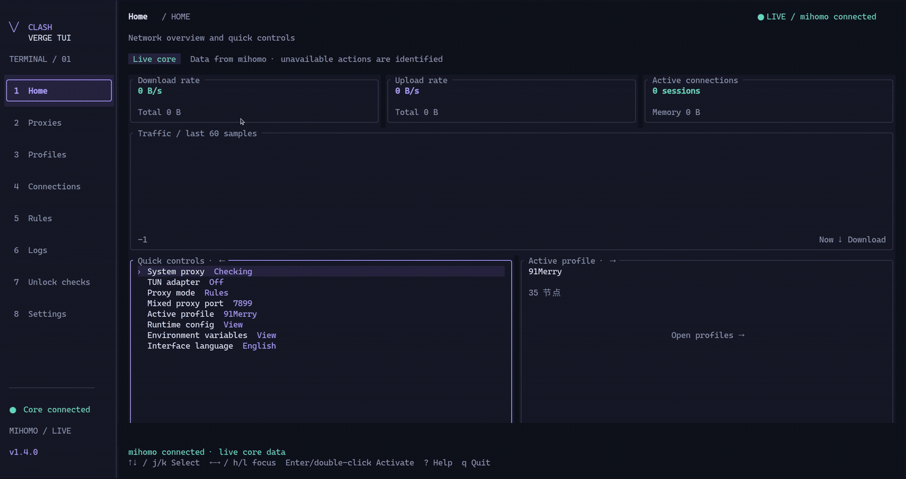
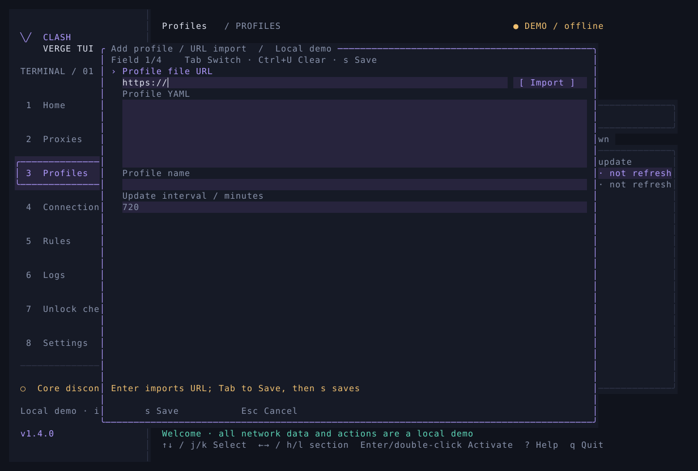
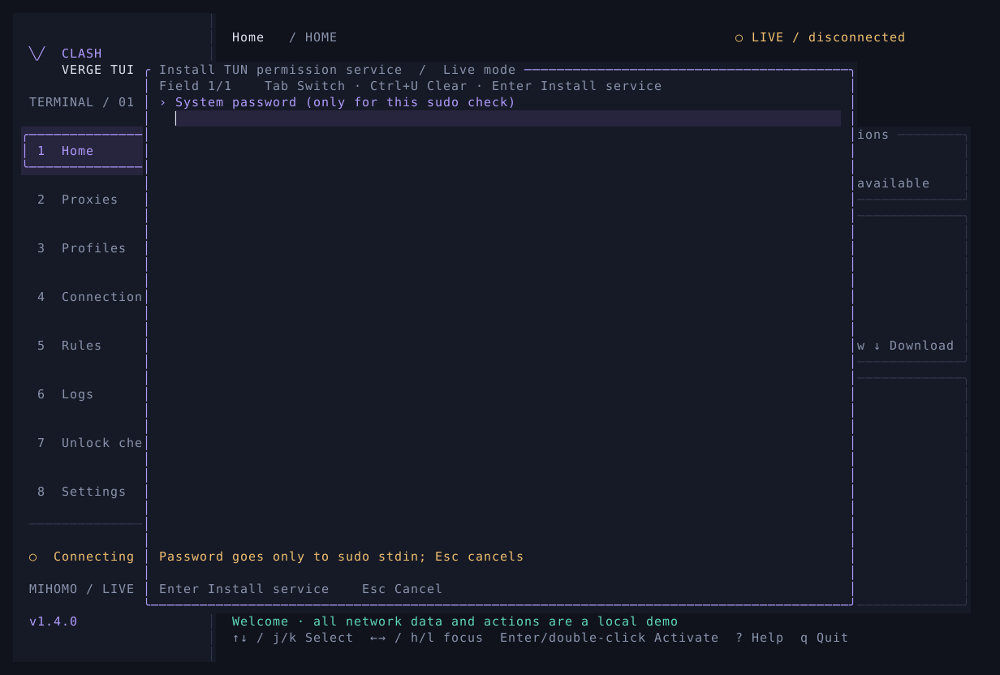

<div align="center">
  <h1>Clash Verge TUI</h1>
  <p><strong>A Linux terminal proxy client built with Rust, Ratatui, and mihomo</strong></p>
  <p><strong>🌎 English</strong>&nbsp;&nbsp;·&nbsp;&nbsp;<a href="README.zh-CN.md">🇨🇳 中文</a></p>
</div>



Created for personal use with development assistance from ChatGPT. The interface and feature mapping follow Clash Verge Rev v2.5.2. This is an unofficial project, independently developed and unaffiliated with the Clash Verge / Clash Verge Rev teams.

`v1.4.6` starts a self-managed workspace and the application-pinned mihomo v1.19.29 by default. Release archives contain the statically linked musl TUI, pinned core, and a pinned `GeoSite.dat` snapshot for Linux x86_64/aarch64, without a system glibc dependency. The installer supports older curl versions, including Ubuntu 20.04’s curl 7.68. Home quick controls show and edit the current mixed proxy port, which defaults to `127.0.0.1:7890`.

## Install and run

Linux x86_64 and aarch64 are supported. Use a UTF-8 terminal; `120 × 40` is recommended and `76 × 24` is the minimum.

```bash
# Install the latest release to ~/.local/bin with its pinned mihomo v1.19.29
curl -fsSL https://github.com/wty-yy/clash-verge-tui/releases/latest/download/install.sh | sh

# Install through the China GitHub mirror
curl -fsSL https://github.com/wty-yy/clash-verge-tui/releases/latest/download/install.sh | sh -s -- --source proxy

# Add ~/.local/bin to PATH once if necessary
export PATH="$HOME/.local/bin:$PATH"

# Open the live TUI and create the managed workspace on first launch
clash-verge-tui

# Check the application, core, and initial configuration without opening the UI
clash-verge-tui --check

# Open the isolated demo without starting mihomo
clash-verge-tui --demo
```

The installer defaults to GitHub. `--source proxy` downloads the pinned release through `gh-proxy.com` without querying GitHub directly. The archive and SHA-256 file are verified before installation:

| Path | Contents |
| --- | --- |
| `~/.local/bin/clash-verge-tui` | TUI executable |
| `~/.local/lib/clash-verge-tui/core/v1.19.29/mihomo` | Versioned core paired with the current application release |
| `~/.local/lib/clash-verge-tui/release.json` | Application, core, architecture, and upstream checksum metadata |
| `~/.local/lib/clash-verge-tui/MIHOMO-LICENSE` | GPL-3.0 license text for the bundled Mihomo core |
| `~/.local/lib/clash-verge-tui/GeoSite.dat` | Pinned Mihomo GeoSite data shipped with the release |
| `~/.local/lib/clash-verge-tui/GEOSITE-LICENSE` | GPL-3.0 license text for the GeoSite data |

The proxy service is third-party infrastructure. It only transports the GitHub release; the installer still verifies the published SHA-256 checksum. Set `CLASH_VERGE_TUI_VERSION=v1.4.6` to select a published version; `CLASH_VERGE_TUI_ASSET_BASE_URL` can point to a compatible mirror for testing.

Source builds work as well. If no bundled core is found, the program downloads official Mihomo v1.19.29 into `${XDG_DATA_HOME:-$HOME/.local/share}/clash-verge-tui/core/`, verifies both the archive and extracted binary, and copies it into the active workspace. A damaged, replaced, or independently upgraded workspace core is restored to the application-pinned version on the next launch.

Release installations copy the bundled `GeoSite.dat` into each workspace before initial configuration validation, with SHA-256 verification and `0600` permissions. Existing workspace data is preserved. Source-only builds and separately configured GeoIP or rule-provider downloads still require their own data files or network access.

```bash
# Build from source with Rust 1.88+
cargo build --locked --release

# Run the source build; the first launch installs the core automatically
./target/release/clash-verge-tui
```

## Interface language

Supports English, Simplified Chinese, and Traditional Chinese, following the system by default. Detection precedence is `LC_ALL` → `LC_MESSAGES` → `LANGUAGE` → `LANG`. `zh_CN` / `zh_SG` select Simplified Chinese; `zh_TW` / `zh_HK` / `zh_MO` select Traditional Chinese. `Hans` / `Hant` override the region. Other locales, including `C` / `POSIX`, use English.

Select Interface language in Home quick controls, press `Enter` or double-click, cycle with `←/→`, and press `s` to apply immediately. The setting is also available under Settings → Interface → Appearance and layout. The preference persists in the current workspace without restarting the core. Profile names, node names, configuration content, and core logs retain their original text.

```bash
# Open in English and save it as the workspace language preference
clash-verge-tui --language en

# Traditional Chinese; use zh-CN for Simplified Chinese
clash-verge-tui --language zh-TW

# Follow the system again
clash-verge-tui --language auto

# English demo; snapshots do not read or save user state
clash-verge-tui --demo --language en
clash-verge-tui --snapshot home --language en --output home-en.svg
```

[Traditional Chinese preview](docs/previews/home-zh-TW.svg)

## Profiles and workspace

Press `a Link import` on Profiles to open the form. Its first row is always **Profile file URL + [ Import ]**, immediately followed by the YAML editor, with the URL focused. Enter or click the button to download and validate the complete Clash YAML asynchronously. When the name is empty, a successful import fills it from the profile title, attachment filename, configuration name, or source domain without replacing a name entered by the user. Use `Tab` / `Shift+Tab` to focus `s Save`, then press `s` or `Enter` to save (or click the button). Local files, direct YAML editing, and private JSON manifests are also supported:



```json
[
  {"name": "Primary", "url": "https://example.com/subscription.yaml"}
]
```

```bash
# Import profiles and start the managed core
clash-verge-tui --subscriptions-file ~/.config/clash-verge-tui/sources.json

# Download or update only; partial failure is nonzero and retains successful entries
clash-verge-tui --import-only --subscriptions-file ~/.config/clash-verge-tui/sources.json

# Explicitly use an already-running proxy when a profile requires one for download
clash-verge-tui --import-only --subscriptions-file ~/.config/clash-verge-tui/sources.json \
  --subscription-proxy http://127.0.0.1:7890

# Select a downloaded profile at startup; numbering starts at 1
clash-verge-tui --profile 1
```

The mixed proxy defaults to `127.0.0.1:7890`; internal control uses a private Unix socket. Home → Quick controls shows the active mixed port; press `Enter` or double-click to edit it. `--mixed-port` can also override the first-start port. A controller secret is generated automatically. Listener addresses, TUN, external controller settings, and provider paths from subscriptions are replaced by workspace-owned settings. System proxy is off by default and must be enabled explicitly in Settings.

The Profiles page supports CRUD, ordering, remote updates, usage and expiry details, YAML editing, and scheduled refresh. Enhancements apply ordered YAML overrides and JavaScript `main(config)` functions. A separate mihomo process validates each composed configuration before it replaces the running one. JavaScript enhancements require Node.js 18+.

The default workspace is `${XDG_STATE_HOME:-$HOME/.local/state}/clash-verge-tui`; use `--data-dir` for another location. The program owns these private files:

| Path | Contents |
| --- | --- |
| `workspace-state.json` | Atomic source of truth for profiles, selection, enhancements, and runtime settings |
| `profiles/` | Original profile configurations, index, and active selection |
| `live-preferences.json` | Theme, layout, Vim, and refresh preferences |
| `core/mihomo`, `core/managed-core.json` | Workspace core copy and application/core version relationship |
| `core/config.yaml`, `core/controller.secret` | Composed runtime configuration and random controller secret |
| `backups/`, `reports/` | Backups, exported logs, and sanitized diagnostics |

Configuration and secret files use Unix mode `0600`; the core uses `0700`. Corrupt files cause an error and remain intact. A workspace lock prevents concurrent writes. Never commit subscription URLs, node credentials, or secrets.

## Service, TUN, and controls

```bash
# Install and enable a systemd user service for the current workspace
clash-verge-tui --service install
clash-verge-tui --service start
clash-verge-tui --service status

# Open the same TUI while the service is active; closing it leaves the service running
clash-verge-tui

# Stop or uninstall the service while retaining user configuration
clash-verge-tui --service stop
clash-verge-tui --service uninstall

# The first TUN enable prompts for the system password and installs the helper service
# It can also be installed or inspected from a normal terminal
clash-verge-tui --tun-service install
clash-verge-tui --tun-service status

# Turn off this workspace’s TUN before removing its permission and DNS services
clash-verge-tui --tun-service uninstall
```

| Key | Action |
| --- | --- |
| `1`–`8` | Home, proxies, profiles, connections, rules, logs, unlock checks, settings |
| `←/→`, `h/l`, `Tab` | Switch home panels or page sections |
| `↑/↓`, `j/k` | Select a row; Vim navigation is enabled by default |
| `Enter` / double-click | Activate a row while preserving confirmation flows |
| `/`, `Esc` | Search, clear a filter, or cancel a dialog |
| `r`, `s`, `m` | Refresh, test, reread profiles, sort, or change mode as shown by the page |
| `d` / `D` | Close the selected / all connections |
| `p` / `c` | Pause logs / clear the UI log buffer |
| `s`, `Ctrl+U` | Save a form / clear a field; while editing text, Tab / Shift+Tab to Save then press s / Enter, or click Save; Ctrl+S remains supported |
| `s` | Save and immediately apply the Home mixed-port form |
| `:`, `?`, `t` | Page palette, help, theme switch |
| `q` / `Ctrl+C` | Quit |

A single click selects an ordinary row. A second click on the same row within 400 ms acts as `Enter`. The Home profile-management button takes focus on the first click and opens on a later click. `Enter` inserts a newline in multiline forms, where Vim letters remain normal text.

Settings → System provides **Install / repair TUN service** and **Uninstall TUN service**. Both use a confirmation and masked password form. Installation does not enable TUN; uninstall requires TUN to be off and keeps profiles and configuration.

System proxy integration supports GNOME manual/PAC modes, restoration, and a guard. The first TUN enable opens a masked password form inside the TUI. The password is sent only to `sudo -S` over standard input and never enters arguments, configuration, or logs. Authorization first grants the current core its capabilities, then installs a systemd path service scoped to the user and workspace. The service verifies the official core and maintains `CAP_NET_ADMIN` / `CAP_NET_BIND_SERVICE` after replacement. A root DNS service accepts only the four TUN DNS operations through a socket scoped to the user and workspace; the system `resolvectl` remains unchanged. Automatic TUN routing is blocked while another active TUN adapter exists; disable TUN in the other app before enabling it here. Existing installations need one password entry in the TUI to upgrade the service; sudo or systemd failures are shown with their specific cause in the TUI. TUN toggles and parameter changes use a controlled core restart, restoring the previous workspace if startup or interface verification fails. Debian/Ubuntu needs `sudo`, systemd, and `libcap2-bin`. Backups support retention, optional encryption, and WebDAV.



## Implementation and releases

- `src/core_manager.rs`: pinned versions, bundled-core discovery, official downloads, dual SHA-256 checks, and automatic repair.
- `src/workspace.rs`, `src/subscriptions.rs`: authoritative manifests, profiles, enhancements, core copies, and transactional rollback.
- `src/core.rs`, `src/live.rs`: mihomo API, logs, reconnection, live state, and action queues.
- `src/platform.rs`, `src/service.rs`: GNOME proxy integration, TUN, and systemd user services.
- `scripts/install.sh`, `scripts/package-linux.sh`: one-line installation and Linux release archives.
- [Feature mapping](docs/FEATURES.md), [agent guidelines](AGENTS.md), [validation](docs/VALIDATION.md).

```bash
# Release checks
cargo fmt --check
cargo clippy --locked --all-targets -- -D warnings
cargo test --locked
cargo build --locked --release

# Export an actual Ratatui buffer without reading user state
clash-verge-tui --snapshot home --output home.svg
```

Pushing a `v*.*.*` tag makes GitHub Actions build Linux x86_64/aarch64 binaries, download and verify the pinned official Mihomo assets, create bundles and checksum files, and publish them with `install.sh` as a GitHub Release. See [release maintenance](docs/RELEASING.md) for version and commit rules.

## License and third-party components

The TUI source is licensed under [MIT](LICENSE). Third-party components retain their own licenses. Bundled mihomo uses GPL-3.0; its license is preserved in [docs/LICENSE-GPL-3.0](docs/LICENSE-GPL-3.0), and the release manifest records the corresponding upstream source.

The table lists direct Rust dependencies pinned in `Cargo.lock` and the bundled core. `OR` denotes alternative licenses. See [third-party licenses](docs/THIRD-PARTY-LICENSES.md) for the complete Rust dependency inventory.

| Component | Version | License |
| --- | --- | --- |
| [mihomo](https://github.com/MetaCubeX/mihomo/tree/v1.19.29) | `1.19.29` | `GPL-3.0` |
| [aes-gcm](https://github.com/RustCrypto/AEADs) | `0.10.3` | `Apache-2.0 OR MIT` |
| [anyhow](https://github.com/dtolnay/anyhow) | `1.0.104` | `MIT OR Apache-2.0` |
| [base64](https://github.com/marshallpierce/rust-base64) | `0.22.1` | `MIT OR Apache-2.0` |
| [clap](https://github.com/clap-rs/clap) | `4.6.6` | `MIT OR Apache-2.0` |
| [crossterm](https://github.com/crossterm-rs/crossterm) | `0.28.1` | `MIT` |
| [flate2](https://github.com/rust-lang/flate2-rs) | `1.1.10` | `MIT OR Apache-2.0` |
| [fs2](https://github.com/danburkert/fs2-rs) | `0.4.3` | `MIT OR Apache-2.0` |
| [futures-util](https://github.com/rust-lang/futures-rs) | `0.3.34` | `MIT OR Apache-2.0` |
| [getrandom](https://github.com/rust-random/getrandom) | `0.2.17` | `MIT OR Apache-2.0` |
| [libc](https://github.com/rust-lang/libc) | `0.2.189` | `MIT OR Apache-2.0` |
| [ratatui](https://github.com/ratatui/ratatui) | `0.29.0` | `MIT` |
| [reqwest](https://github.com/seanmonstar/reqwest) | `0.12.28` | `MIT OR Apache-2.0` |
| [roxmltree](https://github.com/RazrFalcon/roxmltree) | `0.20.0` | `MIT OR Apache-2.0` |
| [scrypt](https://github.com/RustCrypto/password-hashes/tree/master/scrypt) | `0.11.0` | `MIT OR Apache-2.0` |
| [semver](https://github.com/dtolnay/semver) | `1.0.28` | `MIT OR Apache-2.0` |
| [serde](https://github.com/serde-rs/serde) | `1.0.229` | `MIT OR Apache-2.0` |
| [serde_json](https://github.com/serde-rs/json) | `1.0.151` | `MIT OR Apache-2.0` |
| [serde_yaml_ng](https://github.com/acatton/serde-yaml-ng) | `0.10.0` | `MIT` |
| [sha2](https://github.com/RustCrypto/hashes) | `0.10.9` | `MIT OR Apache-2.0` |
| [tempfile](https://github.com/Stebalien/tempfile) | `3.27.0` | `MIT OR Apache-2.0` |
| [tokio](https://github.com/tokio-rs/tokio) | `1.53.1` | `MIT` |
| [unicode-width](https://github.com/unicode-rs/unicode-width) | `0.2.0` | `MIT OR Apache-2.0` |
| [url](https://github.com/servo/rust-url) | `2.5.8` | `MIT OR Apache-2.0` |
| [zeroize](https://github.com/RustCrypto/utils) | `1.9.0` | `Apache-2.0 OR MIT` |

Clash Verge Rev is the interface and feature reference; its upstream license is GPL-3.0. The optional JavaScript enhancement runtime [Node.js](https://github.com/nodejs/node/blob/main/LICENSE) uses MIT and includes components distributed under their respective licenses.

Static release bundles include the [musl license and copyright notices](docs/LICENSE-MUSL), sourced from [musl v1.2.5](https://git.musl-libc.org/cgit/musl/tree/COPYRIGHT?h=v1.2.5).

Bundled GeoSite data comes from [MetaCubeX/meta-rules-dat](https://github.com/MetaCubeX/meta-rules-dat) under GPL-3.0, with its snapshot URL and SHA-256 recorded in `release.json` and the license included in the archive.
