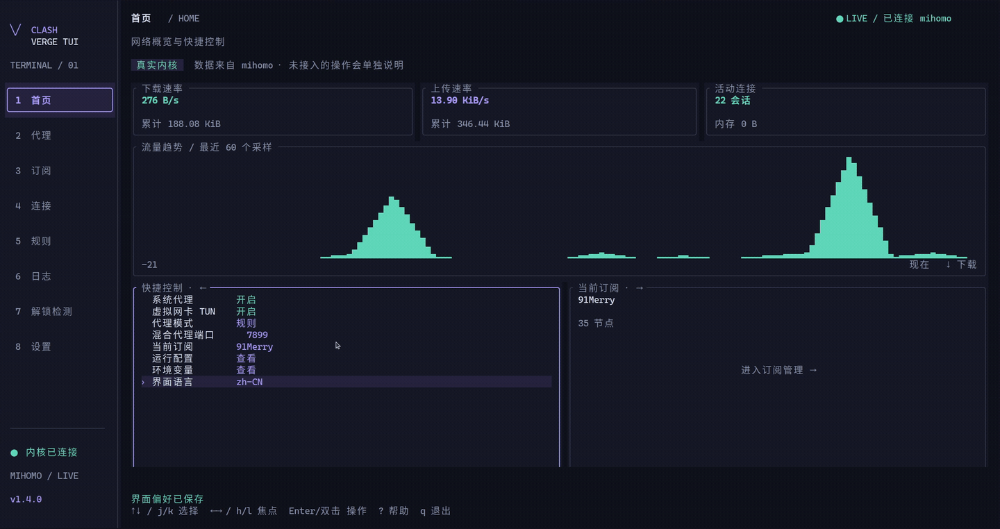
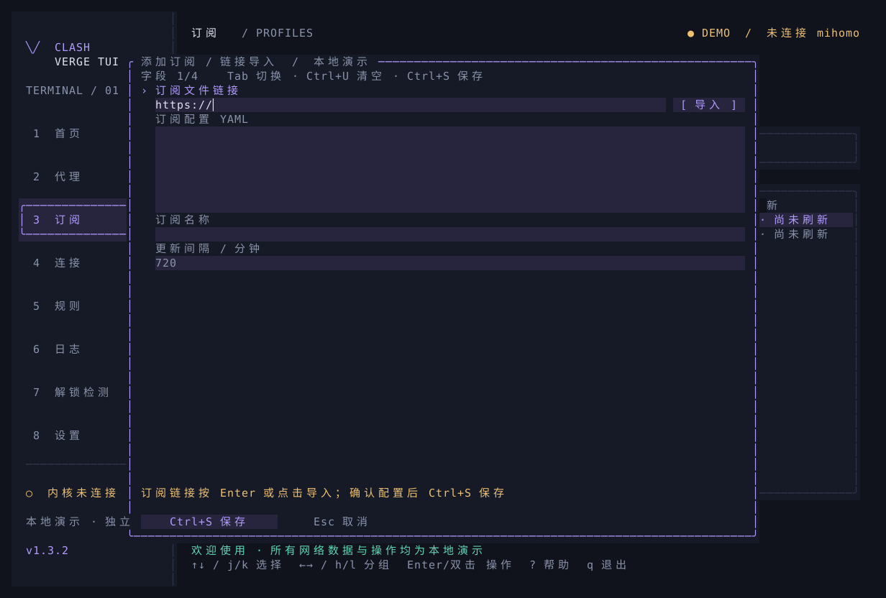
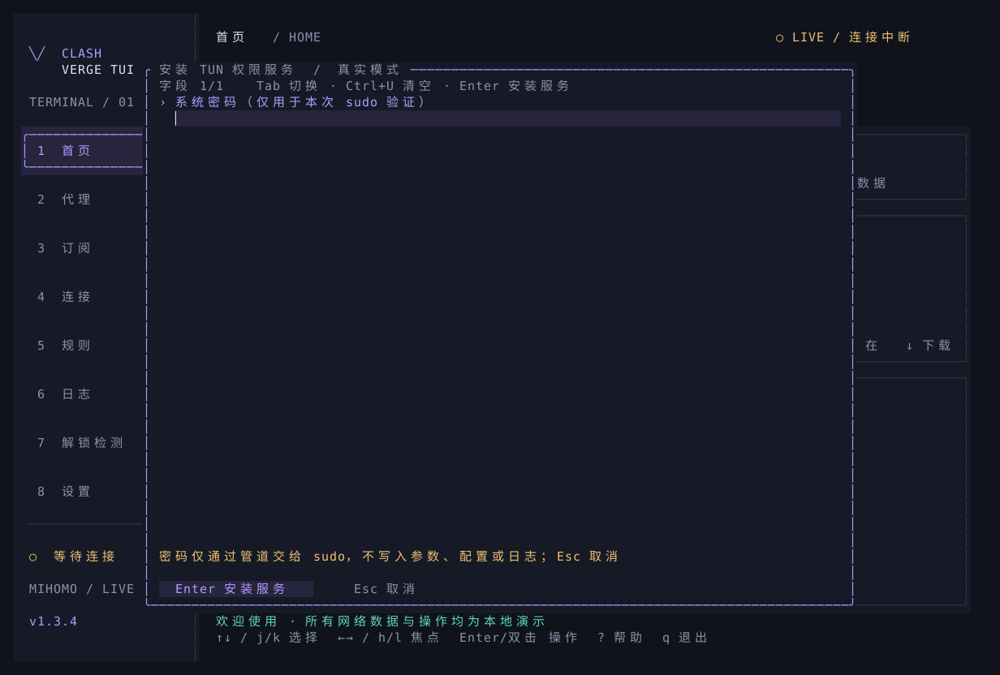

<div align="center">
  <h1>Clash Verge TUI</h1>
  <p><strong>基于 Rust、Ratatui 和 mihomo 的 Linux 终端代理客户端</strong></p>
  <p><a href="README.md">🌎 English</a>&nbsp;&nbsp;·&nbsp;&nbsp;<strong>🇨🇳 中文</strong></p>
</div>



该项目为个人使用而制作，使用 ChatGPT 辅助开发，界面与功能映射参考 Clash Verge Rev v2.5.2。该项目非 Clash Verge / Clash Verge Rev 官方制作，与其开发团队无隶属关系。

`v1.4.3` 默认启动自管工作区和随应用固定的 mihomo v1.19.29。Linux x86_64/aarch64 发行包包含 musl 静态链接 TUI、固定内核和固定版本的 `GeoSite.dat`，不依赖系统 glibc；安装脚本兼容 Ubuntu 20.04 的 curl 7.68 等旧版本。首页快捷控制显示并可修改当前混合代理端口，默认监听 `127.0.0.1:7890`。

## 安装与启动

支持 Linux x86_64 与 aarch64。需要 UTF-8 终端，推荐尺寸 `120 × 40`，最低 `76 × 24`。

```bash
# 一键安装最新发行版到 ~/.local/bin，并同步安装 mihomo v1.19.29
curl -fsSL https://github.com/wty-yy/clash-verge-tui/releases/latest/download/install.sh | sh

# 从 Gitee 安装（镜像需包含发行版组合包与校验文件）
curl -fsSL https://gitee.com/wty-yy/clash-verge-tui/raw/master/scripts/install.sh | sh -s -- --source gitee

# ~/.local/bin 不在 PATH 时添加一次
export PATH="$HOME/.local/bin:$PATH"

# 默认进入真实 TUI；首次启动创建自管工作区
clash-verge-tui

# 只检查应用、内核和初始配置，不打开界面
clash-verge-tui --check

# 独立演示界面，不启动 mihomo
clash-verge-tui --demo
```

安装脚本默认使用 GitHub；`--source gitee` 通过 Gitee 发行版 API 查询版本，并从 Gitee 下载应用与内核组合包及 SHA-256 文件。两种来源均先校验归档，再安装：

| 路径 | 内容 |
| --- | --- |
| `~/.local/bin/clash-verge-tui` | TUI 程序 |
| `~/.local/lib/clash-verge-tui/core/v1.19.29/mihomo` | 与当前发行版配套的版本化内核 |
| `~/.local/lib/clash-verge-tui/release.json` | 应用、内核、架构和上游校验信息 |
| `~/.local/lib/clash-verge-tui/MIHOMO-LICENSE` | 随包 Mihomo 的 GPL-3.0 许可文本 |
| `~/.local/lib/clash-verge-tui/GeoSite.dat` | 随包固定版本的 Mihomo GeoSite 数据 |
| `~/.local/lib/clash-verge-tui/GEOSITE-LICENSE` | GeoSite 数据的 GPL-3.0 许可文本 |

Gitee 仓库同步不包含发行版附件。镜像需创建同版本标签的发行版，并上传两个 Linux 组合包、对应 `.sha256` 和 `install.sh`，见[版本维护](docs/RELEASING.md)。Gitee 发行版或附件缺失时停止安装，不切换到 GitHub。可在 `sh` 命令前设置 `CLASH_VERGE_TUI_VERSION=v1.4.3` 选择已发布版本；`CLASH_VERGE_TUI_REPOSITORY` 可指定自定义仓库，显式 `--source` 优先。

源码构建同样可用。找不到发行包内核时，程序会将 Mihomo 官方 v1.19.29 下载到 `${XDG_DATA_HOME:-$HOME/.local/share}/clash-verge-tui/core/`，校验压缩包与解压后二进制，再复制到当前工作区。工作区内核损坏、被替换或被独立升级后，会在下次启动恢复为应用固定版本。

发行包安装会在首次配置校验前将随包 `GeoSite.dat` 复制到每个工作区，校验 SHA-256 并设置 `0600` 权限，保留工作区内已有数据。仅从源码构建，以及另外配置的 GeoIP 或规则集合下载，仍需要相应数据文件或网络访问。

```bash
# 从源码构建；Rust 1.88+
cargo build --locked --release

# 运行源码构建，首次启动自动安装内核
./target/release/clash-verge-tui
```

## 界面语言

支持 English、简体中文与繁體中文，默认跟随系统。语言识别优先级为 `LC_ALL` → `LC_MESSAGES` → `LANGUAGE` → `LANG`；`zh_CN` / `zh_SG` 使用简体，`zh_TW` / `zh_HK` / `zh_MO` 使用繁体，`Hans` / `Hant` 优先于地区，其他语言及 `C` / `POSIX` 使用英文。

首页快捷控制选择“界面语言”，按 `Enter` 或双击打开，用 `←/→` 切换，按 `s` 保存后立即生效。也可从“设置 → 界面 → 外观与布局”修改。语言保存在当前工作区，无需重启内核。订阅名称、节点名称、配置内容与内核日志保留原文。

```bash
# 使用英文界面，并保存为当前工作区的语言偏好
clash-verge-tui --language en

# 繁体中文；简体中文对应 zh-CN
clash-verge-tui --language zh-TW

# 恢复跟随系统
clash-verge-tui --language auto

# 英文演示界面；快照不会读取或保存用户状态
clash-verge-tui --demo --language en
clash-verge-tui --snapshot home --language en --output home-en.svg
```

[繁体中文预览](docs/previews/home-zh-TW.svg)

## 订阅与工作区

在订阅页按 `a 链接导入` 打开添加表单。第一行固定显示“订阅文件链接 + `[ 导入 ]`”，下面紧接“订阅配置 YAML”；链接默认获得焦点。按 `Enter` 或点击按钮后异步下载并校验完整 Clash YAML。导入成功会在名称为空时根据订阅标题、附件文件名、配置名称或来源域名自动填写，手工名称不会被覆盖；检查内容后用 `Tab` / `Shift+Tab` 将焦点移到 `s 保存` 按钮，再按 `s` 或 `Enter` 保存（也可点击按钮）。也可输入本地文件、直接编辑 YAML，或创建一个私有 JSON 清单：



```json
[
  {"name": "Primary", "url": "https://example.com/subscription.yaml"}
]
```

```bash
# 导入后直接启动自管内核
clash-verge-tui --subscriptions-file ~/.config/clash-verge-tui/sources.json

# 仅下载或更新；部分失败时返回非零状态并保留成功项
clash-verge-tui --import-only --subscriptions-file ~/.config/clash-verge-tui/sources.json

# 订阅需要已有代理时显式指定下载代理
clash-verge-tui --import-only --subscriptions-file ~/.config/clash-verge-tui/sources.json \
  --subscription-proxy http://127.0.0.1:7890

# 启动时选择已下载订阅，编号从 1 开始
clash-verge-tui --profile 1
```

默认混合代理端口为 `127.0.0.1:7890`，内部控制使用私有 Unix socket。首页“快捷控制”中的“混合代理端口”显示当前值，按 `Enter` 或双击可编辑；启动参数 `--mixed-port` 也可覆盖首次启动端口。控制器密钥自动生成。订阅带入的监听地址、TUN、外部控制器和 provider 文件路径会被工作区配置覆盖；系统代理默认关闭，只能在设置页显式开启。

订阅页支持增删改、排序、远程更新、用量与到期信息、YAML 编辑和定时更新。配置增强支持按顺序执行 YAML 覆写与 JavaScript `main(config)`，新配置经独立 mihomo 进程校验后才会替换运行配置。JavaScript 增强需要 Node.js 18+。

默认工作区为 `${XDG_STATE_HOME:-$HOME/.local/state}/clash-verge-tui`，`--data-dir` 可指定另一目录。程序自己维护以下私有文件：

| 路径 | 内容 |
| --- | --- |
| `workspace-state.json` | 原子保存的权威清单：订阅、当前选择、增强和运行设置 |
| `profiles/` | 原始订阅配置、索引和活动项 |
| `live-preferences.json` | 主题、布局、Vim 与刷新等界面偏好 |
| `core/mihomo`、`core/managed-core.json` | 工作区内核副本与应用/内核版本关系 |
| `core/config.yaml`、`core/controller.secret` | 组合后的运行配置与随机控制密钥 |
| `backups/`、`reports/` | 备份、日志导出和去敏诊断 |

配置和密钥使用 Unix `0600` 权限，内核使用 `0700`。损坏文件会报错并保留原内容；同一工作区使用进程锁避免并发写入。订阅 URL、节点凭据和密钥不要提交到 Git。

## 服务、TUN 与操作

```bash
# 安装并启用当前工作区的 systemd 用户服务
clash-verge-tui --service install
clash-verge-tui --service start
clash-verge-tui --service status

# 服务运行时直接打开同一 TUI；退出界面不会停止服务
clash-verge-tui

# 停止或卸载服务；用户配置仍保留
clash-verge-tui --service stop
clash-verge-tui --service uninstall

# 首次开启 TUN 时界面会提示系统密码并自动安装权限服务
# 也可在普通终端中手动触发或检查
clash-verge-tui --tun-service install
clash-verge-tui --tun-service status

# 先关闭当前工作区的 TUN，再卸载权限与 DNS 服务
clash-verge-tui --tun-service uninstall
```

| 按键 | 操作 |
| --- | --- |
| `1`–`8` | 首页、代理、订阅、连接、规则、日志、解锁检测、设置 |
| `←/→`、`h/l`、`Tab` | 切换首页区域或页内分组 |
| `↑/↓`、`j/k` | 选择条目；Vim 导航默认开启 |
| `Enter` / 鼠标双击 | 执行条目操作，保留已有确认流程 |
| `/`、`Esc` | 搜索、清除筛选或取消弹窗 |
| `r`、`s`、`m` | 按页面刷新、测速、重读订阅、排序或切换模式 |
| `d` / `D` | 关闭选中 / 全部连接 |
| `p` / `c` | 暂停日志 / 清空界面日志 |
| `s`、`Ctrl+U` | 保存表单、清空字段；文本编辑时先用 Tab / Shift+Tab 聚焦保存按钮，再按 s / Enter，或点击保存；Ctrl+S 兼容保留 |
| `s` | 在首页混合代理端口表单中保存并立即应用 |
| `:`、`?`、`t` | 页面跳转、帮助、主题切换 |
| `q` / `Ctrl+C` | 退出 |

普通列表单击只选择，400 毫秒内双击同一条目等同 `Enter`。首页“进入订阅管理”第一次点击只聚焦，再点击进入。多行表单中 `Enter` 换行，Vim 字母作为普通输入。

“设置 → 系统”提供“安装 / 修复 TUN 权限服务”和“卸载 TUN 权限服务”，均经过确认与遮罩密码表单。安装不会开启 TUN；卸载前需关闭 TUN，并保留订阅与配置。

系统代理支持 GNOME 手动/PAC 模式、原设置恢复和守卫。TUN 首次开启在 TUI 内显示遮罩密码框，密码只通过标准输入交给 `sudo -S`，不进入命令参数、配置或日志；授权后先为当前内核设置能力，再安装按用户和工作区隔离的 systemd 路径服务。该服务验证官方内核并维护 `CAP_NET_ADMIN` / `CAP_NET_BIND_SERVICE`，通过按用户和工作区隔离的 socket，将四种 TUN DNS 操作交给受限 root 服务，系统 `resolvectl` 保持不变；旧服务首次使用需在 TUI 内输入一次密码升级，内核替换后自动重新授权；sudo 或 systemd 失败会在 TUI 中显示具体原因。检测到其他活动 TUN 网卡时阻止开启自动路由，需要先在对应应用中关闭 TUN。TUN 开关与参数变化通过受控重启生效，重启或网卡验证失败时恢复原工作区。Debian/Ubuntu 需要 `sudo`、systemd 和 `libcap2-bin`。备份支持最近 10 份、本地恢复、可选加密和 WebDAV。



## 实现与发布

- `src/core_manager.rs`：固定版本、发行包发现、官方下载、双重 SHA-256 校验与自动修复。
- `src/workspace.rs`、`src/subscriptions.rs`：权威清单、订阅、配置增强、内核副本与事务回滚。
- `src/core.rs`、`src/live.rs`：mihomo API、日志、重连、真实状态和操作队列。
- `src/platform.rs`、`src/service.rs`：GNOME 系统代理、TUN 与 systemd 用户服务。
- `scripts/install.sh`、`scripts/package-linux.sh`：一键安装与 Linux 发行包。
- [功能对照](docs/FEATURES.md)、[协作约定](AGENTS.md)、[验证记录](docs/VALIDATION.md)。

```bash
# 发布前检查
cargo fmt --check
cargo clippy --locked --all-targets -- -D warnings
cargo test --locked
cargo build --locked --release

# 导出实际 Ratatui 缓冲区快照，不读取用户状态
clash-verge-tui --snapshot home --output home.svg
```

推送 `v*.*.*` 标签后，GitHub Actions 为 Linux x86_64/aarch64 构建应用，下载并校验固定的官方 Mihomo 资产，生成组合包、校验文件和 `install.sh`，再发布 GitHub Release。版本和提交格式见 [版本维护](docs/RELEASING.md)。

## 许可与第三方组件

该项目的 TUI 源码采用 [MIT](LICENSE) 协议。第三方组件保留各自的许可；随包 mihomo 使用 GPL-3.0，许可原文保存在 [docs/LICENSE-GPL-3.0](docs/LICENSE-GPL-3.0)，发行清单记录对应上游源码。

下表列出 `Cargo.lock` 锁定的直接 Rust 依赖与随包内核。`OR` 表示可选许可；完整 Rust 依赖清单见 [第三方许可](docs/THIRD-PARTY-LICENSES.md)。

| 组件 | 版本 | 许可 |
| --- | --- | --- |
| [mihomo](https://github.com/MetaCubeX/mihomo/tree/v1.19.29) | `1.19.29` | `GPL-3.0` |
| [aes-gcm](https://github.com/RustCrypto/AEADs) | `0.10.3` | `Apache-2.0 OR MIT` |
| [anyhow](https://github.com/dtolnay/anyhow) | `1.0.104` | `MIT OR Apache-2.0` |
| [base64](https://github.com/marshallpierce/rust-base64) | `0.22.1` | `MIT OR Apache-2.0` |
| [clap](https://github.com/clap-rs/clap) | `4.6.6` | `MIT OR Apache-2.0` |
| [crossterm](https://github.com/crossterm-rs/crossterm) | `0.28.1` | `MIT` |
| [flate2](https://github.com/rust-lang/flate2-rs) | `1.1.10` | `MIT OR Apache-2.0` |
| [fs2](https://github.com/danburkert/fs2-rs) | `0.4.3` | `MIT OR Apache-2.0` |
| [futures-util](https://github.com/rust-lang/futures-rs) | `0.3.34` | `MIT OR Apache-2.0` |
| [getrandom](https://github.com/rust-random/getrandom) | `0.2.17` | `MIT OR Apache-2.0` |
| [libc](https://github.com/rust-lang/libc) | `0.2.189` | `MIT OR Apache-2.0` |
| [ratatui](https://github.com/ratatui/ratatui) | `0.29.0` | `MIT` |
| [reqwest](https://github.com/seanmonstar/reqwest) | `0.12.28` | `MIT OR Apache-2.0` |
| [roxmltree](https://github.com/RazrFalcon/roxmltree) | `0.20.0` | `MIT OR Apache-2.0` |
| [scrypt](https://github.com/RustCrypto/password-hashes/tree/master/scrypt) | `0.11.0` | `MIT OR Apache-2.0` |
| [semver](https://github.com/dtolnay/semver) | `1.0.28` | `MIT OR Apache-2.0` |
| [serde](https://github.com/serde-rs/serde) | `1.0.229` | `MIT OR Apache-2.0` |
| [serde_json](https://github.com/serde-rs/json) | `1.0.151` | `MIT OR Apache-2.0` |
| [serde_yaml_ng](https://github.com/acatton/serde-yaml-ng) | `0.10.0` | `MIT` |
| [sha2](https://github.com/RustCrypto/hashes) | `0.10.9` | `MIT OR Apache-2.0` |
| [tempfile](https://github.com/Stebalien/tempfile) | `3.27.0` | `MIT OR Apache-2.0` |
| [tokio](https://github.com/tokio-rs/tokio) | `1.53.1` | `MIT` |
| [unicode-width](https://github.com/unicode-rs/unicode-width) | `0.2.0` | `MIT OR Apache-2.0` |
| [url](https://github.com/servo/rust-url) | `2.5.8` | `MIT OR Apache-2.0` |
| [zeroize](https://github.com/RustCrypto/utils) | `1.9.0` | `Apache-2.0 OR MIT` |

Clash Verge Rev 仅作为界面与功能参考，上游采用 GPL-3.0。可选 JavaScript 增强运行时 [Node.js](https://github.com/nodejs/node/blob/main/LICENSE) 采用 MIT，并包含按各自许可分发的第三方组件。

静态发行包附带 [musl 许可及版权声明](docs/LICENSE-MUSL)，原文来自 [musl v1.2.5](https://git.musl-libc.org/cgit/musl/tree/COPYRIGHT?h=v1.2.5)。

随包 GeoSite 数据来自 [MetaCubeX/meta-rules-dat](https://github.com/MetaCubeX/meta-rules-dat)，采用 GPL-3.0；`release.json` 记录快照地址与 SHA-256，归档附带许可文本。
