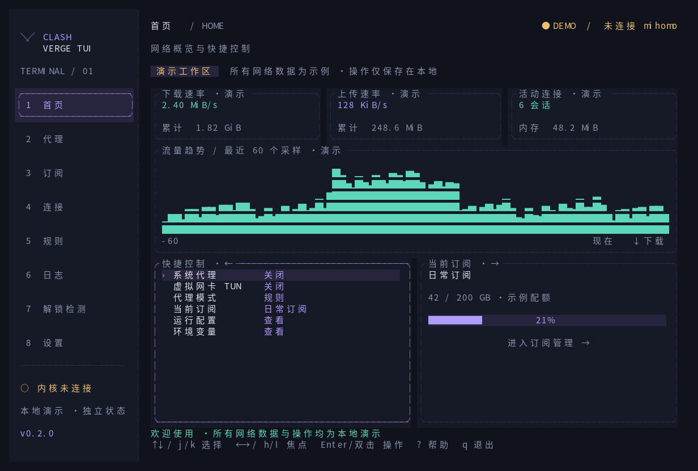

# Clash Verge TUI

[English](README.md) | [更新记录](CHANGELOG.zh-CN.md)

基于 Rust + Ratatui 的 mihomo 终端客户端，界面参照 Clash Verge Rev v2.5.2。

`v0.2.0` 支持连接现有内核，或通过订阅启动独立 mihomo。已接入真实状态、节点选择、测速、模式切换、连接关闭、规则启停、规则集合更新及日志。演示模式继续保留完整界面预览。



## 使用

Linux；Rust 1.88+；支持 UTF-8 的终端。建议 120 × 40，最低 76 × 24。独立运行需已安装 mihomo 或 verge-mihomo。

```bash
# 编译与安装
cargo build --locked --release
cargo install --locked --path .

# 演示模式；不传连接参数时也默认进入演示
clash-verge-tui --demo

# 连接已启用外部控制器的 mihomo；密钥也可由 MIHOMO_SECRET 提供
clash-verge-tui --connect http://127.0.0.1:9090 --secret-file /path/to/controller.secret

# 连接诊断；输出版本、节点条目、策略组、规则和连接数量
clash-verge-tui --connect http://127.0.0.1:9090 --secret-file /path/to/controller.secret --check
```

在 `.local/sources.json` 中填写订阅清单，将示例 URL 替换为实际地址：

```json
[
  {"name": "Primary", "url": "https://example.com/subscription.yaml"}
]
```

```bash
# 导入订阅并启动独立内核；使用自己的 mihomo 路径
clash-verge-tui --core /usr/bin/verge-mihomo --subscriptions-file .local/sources.json --data-dir .local/live

# 后续直接使用已下载的订阅；编号从 1 开始
clash-verge-tui --core /usr/bin/verge-mihomo --data-dir .local/live --profile 1

# 无界面验证订阅是否能被内核加载
clash-verge-tui --core /usr/bin/verge-mihomo --data-dir .local/live --profile 1 --check

# 仅下载或更新订阅；部分失败时返回非零状态，保留成功结果
clash-verge-tui --import-only --subscriptions-file .local/sources.json --data-dir .local/live

# 订阅需要代理下载时，先启动可用内核，在另一终端导入同格式的额外清单
clash-verge-tui --import-only --subscriptions-file .local/extra-sources.json --subscription-proxy http://127.0.0.1:17897 --data-dir .local/live
```

`--core` 默认使用 `127.0.0.1:17897` 混合代理端口与 `127.0.0.1:19097` 控制器，可用 `--mixed-port` / `--controller-port` 修改。控制器密钥自动生成。订阅中的监听地址、TUN、外部控制器和 provider 文件路径会被独立运行配置覆盖；不修改系统代理。

`--core` 启动的子进程在退出界面后停止。`--connect` 不管理已有内核的生命周期，也不接管其订阅。需要经过代理才能获取的订阅，可在清单条目中设置 `proxy`，或使用 `--subscription-proxy`；下载代理必须已经运行。

导入新订阅后，独立模式的订阅页按 `r` 重读本地列表，按 `Enter` 应用所选配置。该页的 `r` 不下载远端订阅。当前支持 Clash YAML，尚不支持 Base64 / URI 列表和 JavaScript 配置增强。

| 按键 | 操作 |
| --- | --- |
| `1`–`8` | 首页、代理、订阅、连接、规则、日志、解锁检测、设置 |
| `←` / `→`、`Tab` / `Shift+Tab` | 首页切换左右区域；其他页面切换分组 |
| `↑` / `↓`、`j` / `k` | 选择条目；Vim 模式默认开启，`h/l` 左右切换 |
| `Enter` / 鼠标双击 | 执行条目操作；确认流程保持有效 |
| `/`、`Esc` | 搜索、清除筛选或取消弹窗 |
| `r`、`s`、`m` | 按工具栏刷新 / 测速 / 重读订阅，排序，切换模式 |
| `d` / `D` | 连接页关闭选中 / 全部连接 |
| `p` / `c` | 日志暂停 / 清空界面缓存 |
| `Ctrl+S`、`Ctrl+U` | 保存表单、清空字段 |
| `:`、`?`、`t` | 页面跳转、帮助、主题切换 |
| `q` / `Ctrl+C` | 退出 |

左侧导航使用整块高亮和较大的点击区域，内容列表保持连续单行。普通列表单击选择，400 毫秒内双击等同 `Enter`。首页订阅管理入口首次点击仅高亮，已有焦点时再次点击进入，不限点击间隔。多行表单中 `Enter` 换行，`Tab` 切换字段，Vim 字母仍作为文本输入。

## 实现细节

- `src/core.rs`：认证 HTTP API、后台通信、日志流与自动重连。
- `src/subscriptions.rs`：订阅下载、独立配置生成与内核子进程管理。
- `src/live.rs`：真实状态映射、操作队列、确认结果与界面偏好。
- `src/model.rs`、`src/app.rs`：数据模型、演示数据、页面状态与交互。
- `src/ui.rs`、`src/settings.rs`：布局、主题、表单和鼠标区域。
- `src/storage.rs`：演示状态加载与原子保存。
- [功能对照](docs/FEATURES.md)、[协作约定](AGENTS.md)、[验证记录](docs/VALIDATION.md)。

默认目录：`${XDG_STATE_HOME:-$HOME/.local/state}/clash-verge-tui`。只接受绝对路径形式的 `XDG_STATE_HOME`；`--data-dir` 优先。

| 路径 | 内容 |
| --- | --- |
| `demo-state.json` | 演示状态，兼容已有界面版本 |
| `live-preferences.json` | 真实模式界面偏好，不保存内核连接数据 |
| `profiles/index.json`、`profiles/profile-N.yaml` | 私有订阅索引与原始配置 |
| `profiles/active.json` | 已应用的订阅索引 |
| `core/config.yaml`、`core/controller.secret` | 独立内核配置与访问密钥 |
| `core/core.log` | 子进程日志，可能包含订阅相关信息 |

这些状态文件在 Unix 下使用 `0600` 权限，不做加密；订阅地址、配置和密钥不要提交到 Git，项目 `.local/` 已忽略。损坏状态文件会报错并保留原内容；同目录并发写入暂不支持。

真实模式不生成模拟流量或模拟成功结果。流量速率由累计字节差与采样间隔计算；日志使用接收时的 UTC 时间。后台请求不阻塞键盘输入，操作完成后读取内核状态，断连时保留最后数据并明确标记。

真实模式目前只开放已接入的操作。系统代理、TUN 管理、解锁检测、自动订阅更新、配置增强、WebDAV 和部分设置仍待实现。网络设置中已接入 IPv6、统一延迟和日志等级；其他未接入设置会说明状态。

## 开发与版本

```bash
# 格式、静态检查与回归测试
cargo fmt --check
cargo clippy --locked --all-targets -- -D warnings
cargo test --locked
cargo build --locked --release

# 导出演示快照；不读取或保存用户状态
clash-verge-tui --snapshot proxies --output proxies.svg
clash-verge-tui --snapshot home --width 100 --height 30

# 重新生成八个主页面的 SVG 快照
for page in home proxies profiles connections rules logs unlock settings; do
  target/release/clash-verge-tui --snapshot "$page" --output "docs/previews/$page.svg"
done
```

版本从 `v0.1.0` 开始，提交格式为 `v版本号: English summary`。主分支为 `master`，使用带注释的 Git 标签；流程见 [版本维护](docs/RELEASING.md)。README 与 CHANGELOG 同步维护中英文版本。

上游参考仓库位于 `upstream/clash-verge-rev`（Git 忽略），固定为 `v2.5.2` / `28f2efc`。本项目为独立实现，不属于官方 Clash Verge Rev 项目。许可：[MIT](LICENSE)。此前的 GPL 参考文本归档于 [docs/LICENSE-GPL-3.0](docs/LICENSE-GPL-3.0)。
